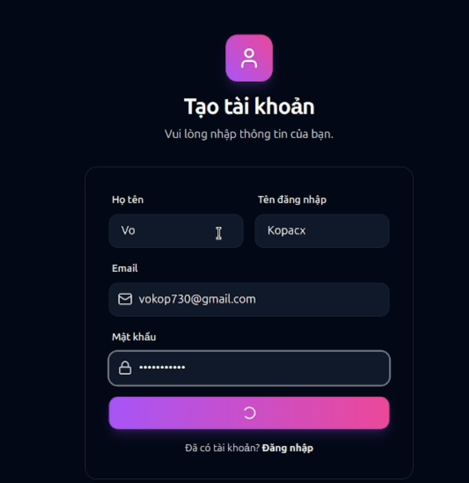
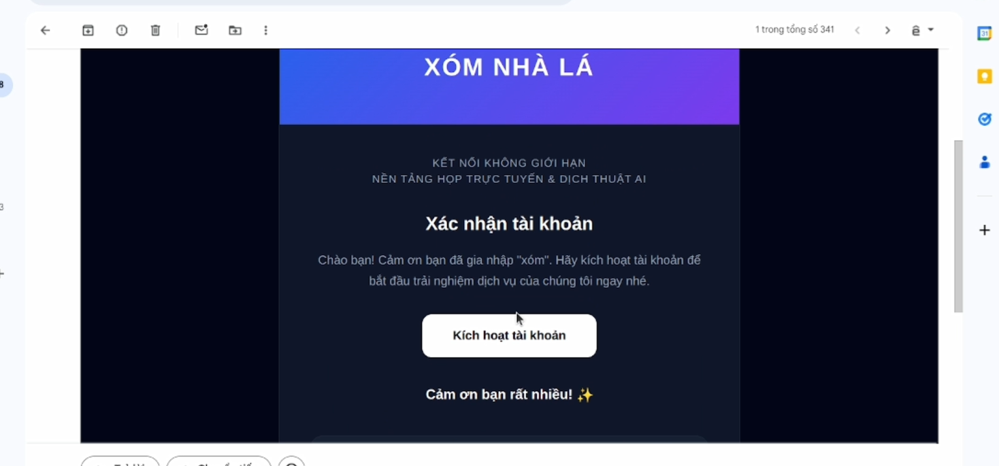
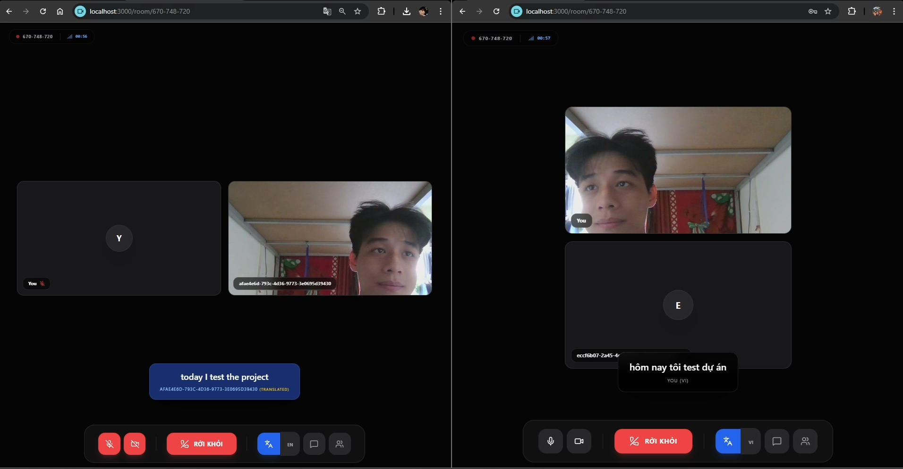

<h1 align="center">🌐 Translator ProMax</h1>
<h3 align="center">Hệ thống Nhận diện & Dịch thuật Giọng nói Thời gian Thực</h3>

<p align="center">
  
  
  
  
  
</p>

---

## 👨‍🏫 Thông Tin Đồ Án

| Thông tin | Chi tiết |
|-----------|----------|
| **Môn học** | Đồ án Công nghệ Thông tin |
| **Giảng viên hướng dẫn** | Th.S Nguyễn Quang Huy |
| **Lớp** | 23DTHA5 |

### 👥 Thành Viên Nhóm

| STT | Họ và Tên | MSSV |
|-----|-----------|------|
| 1 | Lê Huỳnh Ngọc | 2380601465 |
| 2 | Nguyễn Công Quang | 2380601806 |
| 3 | Nguyễn Trường Phát | 2380681640 |
| 4 | Nguyễn Thanh Bảo Ngân | 2380601424 |
| 5 | Ngô Nguyễn Thu Hương | 2380600942 |
| 6 | Trương Thị Yến Nhi | 2380601581 |
| 7 | Nguyễn Phương Nam | 2380613311 |
| 8 | Ngô Cẩm Nhung | 2380601588 |

---

## 📋 Giới Thiệu Dự Án

**Translator ProMax** là một hệ thống hội nghị trực tuyến tích hợp trí tuệ nhân tạo, cho phép người dùng giao tiếp qua giọng nói và nhận bản dịch **thời gian thực** sang ngôn ngữ của người nghe. Hệ thống giải quyết rào cản ngôn ngữ trong các cuộc họp quốc tế, hỗ trợ đa ngôn ngữ với độ trễ tối thiểu.

### ✨ Tính Năng Nổi Bật

- 🎙️ **Speech-to-Text (STT)** – Nhận diện giọng nói trực tiếp tại trình duyệt
- 🌍 **Dịch thuật AI** – Sử dụng mô hình ngôn ngữ lớn (NLLB/Whisper) chạy trên Google Colab GPU
- 🔊 **Text-to-Speech (TTS)** – Phát âm kết quả dịch tự động
- 📹 **Hội nghị video P2P** – Kết nối ngang hàng qua WebRTC (PeerJS)
- 🏠 **Quản lý phòng họp** – Tạo/tham gia phòng có mật khẩu, bật/tắt AI
- 🌐 **Đa ngôn ngữ giao diện** – Hỗ trợ Tiếng Việt và Tiếng Anh
- 🌙 **Dark/Light Mode** – Giao diện đổi chủ đề động
- 🔐 **Xác thực người dùng** – Đăng ký, đăng nhập qua Supabase Auth

---

## 🖼️ Demo Ảnh

### Màn hình Đăng ký Tài khoản


### Xác nhận Email qua Gmail


### Giao diện Phòng Dịch Thuật Thời Gian Thực


---

## 🏗️ Kiến Trúc Hệ Thống

Hệ thống hoạt động theo mô hình **Hub-and-Spoke**, trong đó Server FastAPI là trung tâm điều phối:

```
┌─────────────────────────────────────────────────────────────────┐
│                       Translator ProMax                         │
│                                                                 │
│   ┌──────────────┐      WebSocket      ┌──────────────────┐     │
│   │  Web Client  │ ◄──────────────────► │  Server FastAPI  │     │
│   │  (React +    │                      │  (Router/Hub)    │     │
│   │   PeerJS)    │      WebRTC (P2P)    │                  │     │
│   └──────────────┘ ◄──────────────────► └────────┬─────────┘     │
│                                                   │               │
│   ┌──────────────┐      WebSocket                 │               │
│   │ Google Colab │ ◄──────────────────────────────┘               │
│   │  AI Worker   │   (Dịch thuật Text-to-Text)                    │
│   │  (GPU T4)    │                                                │
│   └──────────────┘                                                │
└─────────────────────────────────────────────────────────────────┘
```

### Luồng Xử Lý Dịch Thuật

```
Người nói A (Tiếng Anh)
      │
      ▼
[STT tại trình duyệt A] → "Hello, how are you?"
      │
      ▼
[WebSocket → Server FastAPI]
      │  (gói tin: src_lang="en", target_lang="vi")
      ▼
[Google Colab AI Worker]
      │  (Model NLLB/Whisper dịch thuật)
      ▼
[Server → WebSocket → Trình duyệt B]
      │
      ▼
[TTS tại trình duyệt B] → 🔊 "Xin chào, bạn khỏe không?"
```

---

## 🛠️ Công Nghệ Sử Dụng

### Frontend
| Công nghệ | Phiên bản | Mục đích |
|-----------|-----------|----------|
| **React** | 19.x | Framework giao diện người dùng |
| **TypeScript** | 5.9 | Ngôn ngữ lập trình có kiểu dữ liệu |
| **Vite** | 7.x | Build tool & Dev server |
| **TailwindCSS** | 3.x | Framework CSS |
| **PeerJS** | 1.5 | WebRTC hội nghị video P2P |
| **Framer Motion** | 12.x | Animation mượt mà |
| **Supabase JS** | 2.x | SDK kết nối database & Auth |
| **React Router** | 7.x | Điều hướng trang |
| **Lucide React** | 0.5+ | Bộ icon hiện đại |

### Backend (Server)
| Công nghệ | Mục đích |
|-----------|----------|
| **FastAPI** | Framework API hiệu năng cao (Python) |
| **Uvicorn** | ASGI Server |
| **WebSockets** | Giao tiếp thời gian thực |
| **Supabase** | Cloud Database & Authentication |
| **pyngrok** | Auto-tunnel qua ngrok |
| **Pydantic** | Xác thực & quản lý cấu hình |

### AI Worker (Google Colab)
| Công nghệ | Mục đích |
|-----------|----------|
| **Google Colab GPU (T4)** | Chạy mô hình AI miễn phí |
| **Whisper (OpenAI)** | Nhận diện giọng nói (STT) |
| **NLLB (Meta)** | Dịch thuật đa ngôn ngữ |
| **Coqui TTS** | Tổng hợp giọng nói (TTS) |

### Database (Supabase)
| Bảng | Mô tả |
|------|-------|
| `rooms` | Thông tin phòng họp (id, name, is_private, password, enable_ai) |
| `profiles` | Hồ sơ người dùng |

---

## 📁 Cấu Trúc Dự Án

```
Translartor_ProMax-main/
│
├── 📁 web/                         # Ứng dụng Web
│   ├── 📁 frontend/                # React + TypeScript App
│   │   ├── 📁 src/
│   │   │   ├── 📁 pages/           # Các trang: Home, Auth, Meeting, Profile...
│   │   │   ├── 📁 context/         # AuthContext, ConfigContext
│   │   │   ├── 📁 hooks/           # Custom React Hooks
│   │   │   ├── 📁 layouts/         # Layout wrapper
│   │   │   ├── i18n.ts             # Đa ngôn ngữ (VI/EN)
│   │   │   ├── config.ts           # Cấu hình Supabase & Server
│   │   │   └── supabase.ts         # Khởi tạo Supabase Client
│   │   ├── package.json
│   │   └── vite.config.ts
│   └── launcher.js                 # Script khởi động Web
│
├── 📁 server/                      # Server Backend
│   ├── 📁 backend/
│   │   ├── 📁 app/
│   │   │   ├── 📁 api/v1/          # REST API Routes
│   │   │   ├── 📁 core/            # Config & Settings
│   │   │   ├── 📁 schemas/         # Pydantic Schemas
│   │   │   └── main.py             # FastAPI App
│   │   ├── requirements.txt        # Python dependencies
│   │   └── main.py                 # Entry point
│   ├── ai_worker_client.py         # AI Worker script (chạy trên Colab)
│   └── Translator_ProMax_Colab_Worker.ipynb  # Notebook Colab
│
├── 📁 android/                     # Ứng dụng Android (đang phát triển)
├── 📁 img/                         # Ảnh demo
├── merNhanh.bat                    # Script chạy nhanh toàn bộ hệ thống
└── README.md
```

---

## 🚀 Hướng Dẫn Cài Đặt & Chạy

### Yêu Cầu Hệ Thống

- **Node.js** v18 trở lên
- **Python** 3.10 trở lên
- **Tài khoản Supabase** (miễn phí tại [supabase.com](https://supabase.com))
- **Tài khoản Google** (để dùng Google Colab)

---

### Bước 1: Cấu Hình Database (Supabase)

1. Tạo dự án mới tại [supabase.com](https://supabase.com).
2. Vào **SQL Editor → New Query**, chạy lệnh sau:

```sql
-- Tạo bảng phòng họp
CREATE TABLE rooms (
  id TEXT PRIMARY KEY,
  name TEXT NOT NULL,
  is_private BOOLEAN DEFAULT FALSE,
  password TEXT,
  enable_ai BOOLEAN DEFAULT TRUE,
  created_at TIMESTAMP WITH TIME ZONE DEFAULT timezone('utc', now())
);
```

3. Lấy **Project URL** và **Anon Key** tại **Project Settings → API**.

---

### Bước 2: Cài Đặt & Chạy Frontend (Web)

```bash
# Di chuyển vào thư mục frontend
cd web/frontend

# Cài đặt thư viện
npm install

# Cấu hình Supabase trong src/config.ts
# Điền SUPABASE_URL và SUPABASE_KEY của bạn vào

# Chạy ứng dụng (mặc định http://localhost:5173)
npm run dev
```

---

### Bước 3: Cài Đặt & Chạy Backend (Server)

```bash
# Di chuyển vào thư mục backend
cd server/backend

# Tạo môi trường ảo Python
python -m venv venv

# Kích hoạt môi trường ảo
# Windows:
.\venv\Scripts\activate
# Linux/macOS:
source venv/bin/activate

# Cài đặt thư viện
pip install -r requirements.txt

# Chạy server (mặc định http://localhost:3001)
python main.py
```

> 💡 **Mẹo**: Để mở tunnel ngrok tự động, thêm biến môi trường `NGROK_TOKEN=<token_của_bạn>` trước khi chạy server.

---

### Bước 4: Kết Nối AI Worker (Google Colab)

1. Truy cập [Google Colab](https://colab.research.google.com/) → Tạo Notebook mới.
2. Chọn **Runtime → Change runtime type → T4 GPU**.
3. Cài đặt thư viện:
   ```python
   !pip install websockets nest_asyncio
   ```
4. Copy nội dung file `server/ai_worker_client.py` vào cell mới.
5. Cập nhật `SERVER_URL` trỏ đến địa chỉ server của bạn và chạy.

---

### 🎯 Chạy Nhanh (Windows)

```bash
# Chạy toàn bộ hệ thống bằng script
merNhanh.bat
```

---

## 📡 API Endpoints

| Method | Endpoint | Mô tả |
|--------|----------|-------|
| `GET` | `/` | Kiểm tra trạng thái server |
| `POST` | `/api/v1/auth/login` | Đăng nhập, lấy Token |
| `POST` | `/api/v1/auth/register` | Đăng ký tài khoản mới |
| `WS` | `/ws/{room_id}/{client_id}?role=user` | WebSocket cho User Client |
| `WS` | `/ws/worker?key={AI_WORKER_KEY}` | WebSocket cho Colab AI Worker |

---

## 🔒 Bảo Mật

- **JWT Token**: Tất cả API được bảo vệ bằng Supabase JWT.
- **AI Worker Key**: Colab Worker phải có `AI_WORKER_KEY` hợp lệ để kết nối.
- **Phòng riêng tư**: Hỗ trợ mật khẩu truy cập phòng họp.
- **Auto-Cleanup**: Phòng họp tự động xóa sau 30 phút không hoạt động.

---

## 🗺️ Lộ Trình Phát Triển

- [x] Xác thực người dùng (Supabase Auth)
- [x] Quản lý phòng họp
- [x] Giao tiếp WebSocket thời gian thực
- [x] Kết nối AI Worker qua Google Colab
- [x] Giao diện đa ngôn ngữ (VI/EN)
- [x] Dark/Light Mode
- [ ] Ứng dụng Android
- [ ] Lịch sử cuộc họp
- [ ] Ghi âm & lưu bản dịch
- [ ] Hỗ trợ thêm ngôn ngữ

---

## 📄 Giấy Phép

Dự án được phát triển phục vụ mục đích học thuật – Đồ án môn học tại trường Đại học.

---

<p align="center">
  Made with ❤️ by <strong>Nhóm 23DTHA5</strong> — Translator ProMax © 2025
</p>
